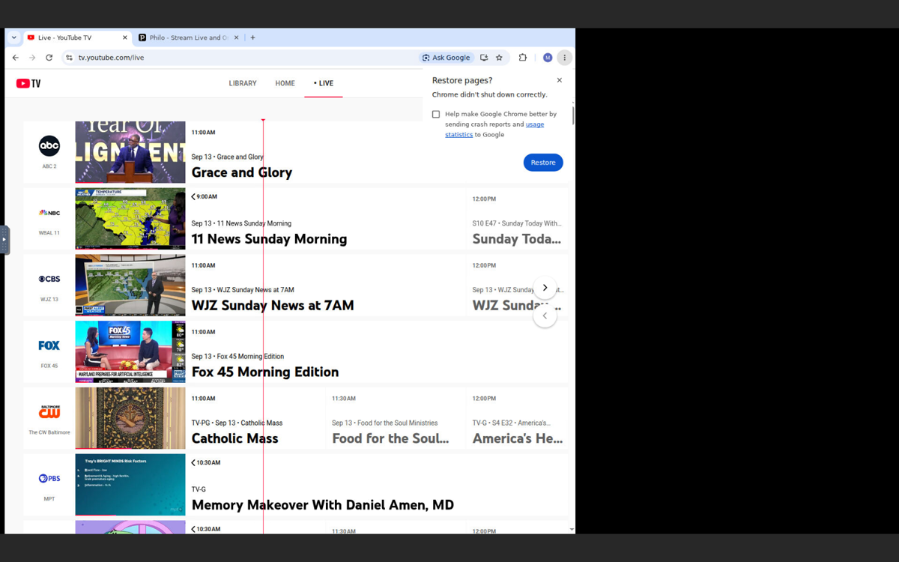
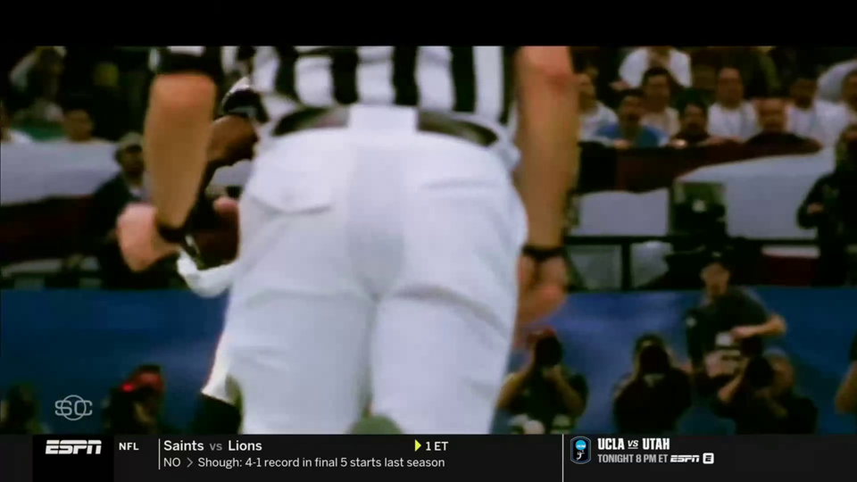

# Task 024 — the container: Dockerfile, entrypoint, viewer, D024 (2026-09-13)

Date: build and smoke run 2026-09-13 00:40–01:00 EDT (04:40–05:00Z);
V2–V7 2026-09-13 07:15–07:25 EDT (11:15–11:25Z), after the owner's go-ahead.
Host: marlinpc. The owner quit the live Chrome before V2 (confirmed: no chrome
process, nothing on 9333 or 8804) and it was never touched by this task. Nothing
on 192.168.1.250 was contacted. `backups/` was read once with `cp -a` and is
byte-identical afterwards (1842 files, 270,807,537 bytes). `data/chrome-profile`
was never read, copied or mounted. No credentials, cookies, tokens, session ids
or account identifiers appear in the image, logs, the notebook or this report;
`VNC_PASSWORD` was passed only as a run-time env var from a 0600 scratch file.

**Result: done. V1–V7 all pass.** One defect found by V6 and fixed in the
entrypoint (app log lines were block-buffered). One run-time requirement
found by the smoke run and ruled by the owner (`--cap-add SYS_ADMIN`,
`--shm-size=1g`, D024 item 8).

---

## Result per step

| Step | Result |
|---|---|
| 1 Dockerfile | done — `ubuntu:24.04`; ffmpeg from apt with a build-time `6.1.x` check; Node 22 from NodeSource; Google Chrome pinned `153.0.8010.36-1` from the dl.google.com pool deb with a version check; Xvfb; x11vnc + noVNC + websockify; fontconfig + fonts-liberation + fonts-dejavu-core; tini; `npm ci` then `src/`, `extension/`, `scripts/start-chrome.sh` |
| 2 entrypoint | done — 7 gated stages (VNC_PASSWORD guard and PUID/PGID user → Singleton removal → Xvfb 1920×1080×24 on :99 → Chrome via `scripts/start-chrome.sh` with both tabs, ready on `/json/version` + tab check → x11vnc loopback + noVNC 6080 → login check → first-boot enumeration → app on 8804 ready on `/health`); SIGTERM handler stops app → Chrome → viewer → Xvfb in order, sweeps everything left running as PUID, reports what is left |
| 3 Host-header URLs | **no code change needed** — `src/server.ts` already builds `/playlist`, `/playlist/*` and every stream URL from the request's `Host` header (`baseUrl()` at `src/server.ts:101`); verified in V7 |
| 4 .dockerignore | done — `data/`, `backups/`, `notebook/reports/`, `node_modules/`, `.git/`, `*.log` |
| 5 notebook | done — D024 (items 1–7 from the rulings, item 8 the run parameters); SESSION-STATE; two KNOWN-FIXES entries (Chrome sandbox under Docker's default caps; `sed` buffering the app log) |

### Files touched, mapped to steps

| File | Step | Change |
|---|---|---|
| `Dockerfile` | 1 | new |
| `docker/entrypoint.sh` | 2 | new; `sed -u` on the three prefix pipes after V6 |
| `.dockerignore` | 4 | new |
| `scripts/start-chrome.sh` | 2 | `MC_PROFILE` overrides the profile path (unset on marlinpc, so the owner's launch is unchanged); the `exec` line and every Chrome flag are untouched |
| `src/channels.ts` | 2 | cache path honours `MC_DATA_DIR` (container: `/data/channels.json`); unset on marlinpc |
| `src/capture.ts` | 2 | `HLS_ROOT` honours `MC_HLS_DIR` (container: `/tmp/marlin-cast/hls`, off the volume); unset on marlinpc |
| `src/providers/index.ts` | test | `MC_PROVIDERS` test knob: restricts login/enumeration/playlist/tune to the named providers, loud when set, unset in production (needed because the basic backup carries no Philo login — brief constraint) |
| `notebook/DECISIONS.md` | 5 | D024 |
| `notebook/SESSION-STATE.md` | 5 | task-024 record |
| `notebook/KNOWN-FIXES.md` | 5 | two entries |
| `notebook/reports/task-024.md`, `task-024/` | report | this file + 2 images |

`extension/`, `src/server.ts`, `src/cdp.ts`, `src/login.ts`, the providers'
own files and `package.json` are unchanged.

---

## Recon questions — all covered

Q1 ports, Q2 viewer, Q3 Chrome pin, Q4 uid, Q6 ffmpeg, Q8 first-boot cache,
Q9 local build and ports, Q10 test profile: ruled by the owner and applied
(D024). Q7 (tag scheme) is in the NOT list. Q5 (stock Xvfb vs D014's decode
test): the rulings choose plain Xvfb and put the VAAPI/decode test outside this
pass, so no VAAPI package is in the image and D024 records that. **No recon
question was left unanswered; nothing was guessed.**

One thing the recon did not raise surfaced in the smoke run: under Docker's
default capability set Chrome's sandbox cannot create its namespaces and Chrome
never starts (KNOWN-FIXES). The owner ruled `--cap-add SYS_ADMIN` +
`--shm-size=1g` (D024 item 8); `--no-sandbox` was not used, so
`scripts/start-chrome.sh`'s flag set is exactly the one every fact was measured
on.

---

## V1 — build and versions

`docker build -t marlin-cast:task024 .` succeeds (rebuilt after the V6 fix:
image `8be09fa00d8b`, 592,373,005 bytes). The build-time gates passed: ffmpeg
matched `^ffmpeg version 6\.1\.`, `google-chrome --version` contained
`153.0.8010.36`, `node --version` matched `^v22\.`.

`docker run --rm --entrypoint sh marlin-cast:task024 -c 'ffmpeg -version | head -1; google-chrome --version; node --version'`:

```
ffmpeg version 6.1.1-3ubuntu5 Copyright (c) 2000-2023 the FFmpeg developers
Google Chrome 153.0.8010.36
v22.23.2
```

dpkg: `ffmpeg 7:6.1.1-3ubuntu5` (the same build as marlinpc),
`google-chrome-stable 153.0.8010.36-1`, `nodejs 22.23.2-1nodesource1`,
`xvfb 2:21.1.12-1ubuntu1.6`, `x11vnc 0.9.16-10`, `novnc 1:1.3.0-2`,
`websockify 0.10.0+dfsg1-5build2`, `tini 0.19.0-1`, `fontconfig 2.15.0-1.1ubuntu2`,
`fonts-liberation 1:2.1.5-3`, `fonts-dejavu-core 2.37-8`.

Running the image with no `VNC_PASSWORD` prints the four-line FATAL and exits
before starting anything (observed twice, once by accident while checking the
rebuilt image).

## Smoke run (before the go-ahead, empty throwaway profile, no login)

With Docker's default capabilities Chrome died at startup:

```
Failed to move to new namespace: PID namespaces supported, Network namespace supported, but failed: errno = Operation not permitted
FATAL:content/browser/zygote_host/zygote_host_impl_linux.cc:213] Zygote process exited prematurely
```

With `--cap-add SYS_ADMIN --shm-size=1g`: Xvfb up, Chrome up with
`navigator.webdriver: false`, 0 Fontconfig lines, viewer up with a wrong
password refused, signed-out enumeration hit the loud FATAL and the container
stayed up with the viewer, `docker stop` 1.06 s with nothing left. That run
also found the backgrounded-function pid bug (`run_as_bg` now `exec`s so `$!`
is the real process).

## V2 — container up on the test profile

Run: `docker run -d --name marlin-cast-t024 --cap-add SYS_ADMIN --shm-size=1g
-p 8091:8804 -p 8092:6080 -v /tmp/mc-test/data:/data -e VNC_PASSWORD=…
-e MC_PROVIDERS=youtubetv marlin-cast:task024`, where `/tmp/mc-test/data/chrome-profile`
is a `cp -a` of `backups/chrome-profile-basic-20260911-110129` (1842 files,
270,807,537 bytes, equal to the backup). 11:15:15Z.

Entrypoint log, every stage:

```
[entrypoint] re-owning /data to 99:100 (was 1000:1000)
[entrypoint] user marlin (99:100); profile /data/chrome-profile; hls /tmp/marlin-cast/hls; display :99 1920x1080x24
[entrypoint] removed stale profile locks: SingletonLock SingletonCookie SingletonSocket
[entrypoint] stage 2 ready: Xvfb :99 1920x1080x24 (pid 29)
[entrypoint] stage 3 ready: Chrome/153.0.8010.36 on 127.0.0.1:9333 (loopback), tabs: tv.youtube.com
[entrypoint] chrome stderr: 0 Fontconfig lines
[entrypoint] stage 4 ready: noVNC on 0.0.0.0:6080 -> x11vnc 127.0.0.1:5900 (password required)
[login] attached: yes  (127.0.0.1:9333, Chrome Chrome/153.0.8010.36)
[login] youtubetv: tv.youtube.com: signed in
[login]   navigator.webdriver: false
[entrypoint] stage 5: every provider signed in
[entrypoint] stage 6: no /data/channels.json — first boot, enumerating the lineup
[entrypoint] stage 6 ready: lineup cached at /data/channels.json
[entrypoint] stage 7 ready: app on 0.0.0.0:8804 (pid 471); channels: 141 state: idle
```

So: each stage ready, **0 Fontconfig lines** in Chrome's stderr,
**`navigator.webdriver: false`**, **YouTube TV signed in** — on a profile copied
from marlinpc (uid 1000) into a container running as 99:100. That closes the
uid gap task-004/005 left open, at least for a `chown -R` on start. The first
boot of the copied profile also confirms Chrome's "Restore pages? Chrome didn't
shut down correctly" bubble on the screen (V3 image) — the backup was taken
from a SIGTERM-stopped profile; harmless, the session is intact.

The `useradd warning: marlin's uid 99 outside of the UID_MIN 1000 and UID_MAX
60000 range` line is cosmetic (`-o` is passed; the user is created).

## V3 — viewer

Opened with a throwaway headless Chrome on the host (temp profile, never the
owner's), through `http://127.0.0.1:8092/vnc.html?autoconnect=true&password=…`:

| attempt | noVNC status |
|---|---|
| wrong password | `New connection has been rejected with reason: password check failed!` — no canvas |
| right password | `Connected (unencrypted) to 0ffdb74b0874:99` — canvas 1920×1080 |



The Chrome window sits at its default size inside the 1920×1080 display, not
maximized. Capture does not depend on it: the tune path forces a 1920×1080
viewport with `Emulation.setDeviceMetricsOverride` (task-008) and V5 confirms
`box 1920x1080, viewport 1920x1080`. A Philo tab is open too —
`scripts/start-chrome.sh` opens both (D018); `MC_PROVIDERS` only restricts the
app.

## V4 — first-boot enumeration

```
[channels] [youtubetv] guide rows 147, tiles 141, channels 141, skipped 6
[channels] enumerated 141 channels at 2026-09-13T11:15:35.253Z
[channels] cached to /data/channels.json
  skipped guide rows (6):
      row 23  ESPN  — no stationId, no watch link
      row 27–29  NBCSN Extra  — no watch link
      row 43  Adult Swim  — no watch link
      row 129  WNBA on ION  — no watch link
```

**141 YouTube TV channels** from 147 guide rows (task-023 read 142 from 151;
the guide this Sunday morning carried 4 fewer rows and no `isDiscreteStation`
event rows at all — lineup drift, the D023 filter simply had nothing to skip).
Philo not enumerated (`MC_PROVIDERS=youtubetv`, brief constraint). The second
start (V6) took the "channel cache present" branch and did not re-enumerate.

## V5 — ESPN row 17 through 8091, 190 s pull

Key `UCW7W_WAogi3qWDbO9PqOmZQ` (row 17, the D015 sliver line carries
`tvc-guide-stationid="32645"`). Pull:
`ffmpeg -t 190 -i http://127.0.0.1:8091/stream/UCW7W_WAogi3qWDbO9PqOmZQ/index.m3u8 -c copy`,
11:17:07Z → 11:20:24Z, exit 0.

- **Cold: playlist with a playable segment after 6.296 s** (task-011 method;
  marlinpc ~4.0–4.3 s). Second start, warm profile: **4.031 s**. tune-ms
  `nav=404 layout=416 playing=1201 pinned=1205` (first), `nav=366 layout=379
  playing=1400 pinned=1402` (second).
- `[tune] ESPN {"ok":true,"target":"hd720","quality":"hd720","video":"1280x720","box":"1920x1080","viewport":"1920x1080"}`
  with the known task-011 warning — ESPN advertises no hd1080.
- `[capture] ESPN recording {… "frameRate":30,"height":1080,"width":1920 …}`.

`/health` during the pull:

| | +20 s | +105 s |
|---|---|---|
| state | streaming | streaming |
| quality | hd720 | hd720 |
| channel | ESPN (UCW7W_WAogi3qWDbO9PqOmZQ) | same |
| chunks_in / bytes_in | 22 / 7,425,999 | 101 / 34,363,324 |
| segments | 11 | 11 |
| last_error | - | - |

Container at +25 s: exactly **1 ffmpeg**, one HLS directory (the key).

**ffprobe on a served segment** (`init.mp4` + `seg00020.m4s` fetched from
8091 mid-pull):

```
video: h264 High 1920x1080 30/1
audio: aac LC 48000 Hz 2 ch
```

**Pulled file, measured:** H.264 High 1920×1080 30 fps, 5700 video frames,
AAC-LC 48 kHz stereo 8907 frames, 190.02 s, 6.06 Mbps.

- **Audio present and not silent** — the recon's default-output-device gap
  is closed: mean −27.3 dB, peak −7.9 dB over the whole pull; the single
  served segment alone reads mean −26.4 dB, peak −13.5 dB.
  `silencedetect` (−50 dB, ≥1 s): **one** run, 149.62–151.06 s (1.44 s),
  sound on both sides.
- **Picture present:** luma YAVG at t=2/5/30/60/90/120/150/180 s =
  47/35/71/47/54/70/88/78 — varying throughout. `blackdetect` (≥0.5 s,
  pic_th 0.98): **two** runs, 56.99–58.85 s (1.87 s) and 70.55–71.29 s
  (0.73 s), picture on both sides. Both the silent run and the black runs are
  brief and mid-stream with content either side — consistent with ad/segment
  transitions in SportsCenter, not with a capture fault (a minimized-tab or
  no-device failure is continuous, task-006).
- A/V: video start 0.021 s, audio 0.000 s; durations 190.000 / 190.016 s.



Pull-side ffmpeg warnings: only the pre-existing `Found duplicated MOOV Atom.
Skipped it` from the live `EXT-X-MAP` reload (task-015), ×188; no other class.

**Idle stop clean:** 22 s after the pull ended `/health` read `state: idle`,
`provider: -`, `segments: 0`; container had **0 ffmpeg**, **0 HLS entries**;
app log `[stop] ESPN: idle 20000ms with no client request`, then
`[stop] parked the youtubetv tab on https://tv.youtube.com/live`. `last_error`
holds ffmpeg's `File ended prematurely` from its own stdin being closed at
stop, the same as on marlinpc.

## V6 — stop, restart, locks

**First stop (after V5):** `docker stop` returned in **1.16 s**, exit code 0.
Entrypoint: `app stopped`, `chrome stopped`, `novnc stopped`, `x11vnc
stopped`, `xvfb stopped`, `shutdown complete: no
chrome/Xvfb/ffmpeg/x11vnc/websockify/node left`. Host `ps` for
`chrome|Xvfb|ffmpeg|x11vnc|websockify`: **none**. The profile volume kept
Chrome's three symlinks — `SingletonLock -> 0ffdb74b0874-33`,
`SingletonCookie`, `SingletonSocket -> /tmp/com.google.Chrome.sdDKi0/…` —
the task-003 behaviour, now pointing at a hostname and a `/tmp` that no
longer exist.

**Defect found here:** `docker logs` had shown **no `[app]` line at all**
during V5; at the stop all 18 arrived at once, `[tune]` lines included. The
entrypoint's `… | sed 's/^/[app] /'` block-buffers because the container's
stdout is a pipe. Fixed with `sed -u` on all three prefix pipes; image
rebuilt from cache (`8be09fa00d8b`).

**Second start** (11:22:27Z, same run line, same volume):

```
[entrypoint] removed stale profile locks: SingletonLock SingletonCookie SingletonSocket
[entrypoint] stage 3 ready: Chrome/153.0.8010.36 on 127.0.0.1:9333 (loopback), tabs: tv.youtube.com
[entrypoint] chrome stderr: 0 Fontconfig lines
[login] youtubetv: tv.youtube.com: signed in
[entrypoint] stage 6: channel cache present (/data/channels.json)
[entrypoint] stage 7 ready: app on 0.0.0.0:8804 (pid 425); channels: 141 state: idle
```

Chrome wrote fresh locks (`SingletonLock -> 2afaec87f218-32`). Tuned ESPN
once: cold 4.031 s; **`[tune]`/`[capture]` lines were visible in `docker
logs` 10 s into the pull** (fix confirmed); 30 s pull exit 0, H.264
1920×1080 + AAC, 30.02 s; idle stop → `state: idle`, 0 ffmpeg. **Second
`docker stop`: 1.19 s**, exit 0, same six shutdown lines, host `ps`: none.
Container removed; no container named `marlin-cast-t024` remains.

## V7 — playlist URLs carry the published port

`GET http://127.0.0.1:8091/playlist`: 283 lines, 141 `#EXTINF`, **141 stream
URLs, all 141 `http://127.0.0.1:8091/stream/<key>/index.m3u8`, 0 with any
other host**. `/playlist/youtube-tv` the same. With the request sent as
`Host: 192.168.1.250:8091` (what Unraid's consumers would send) every one of
the 141 URLs reads `http://192.168.1.250:8091/stream/…`. `GET /` shows
`http://127.0.0.1:8091/playlist` and `/health`. The app itself still logs
`http://127.0.0.1:8804/playlist` at startup — that is its own bind address,
not what a consumer is given.

---

## Not testable here, and what was traced

- **Philo in the container** — the basic backup has no Philo login (brief:
  untested until deploy). Traced: `start-chrome.sh` opens the Philo tab
  (seen in the V3 image); the entrypoint's tab check and the app's provider
  list both follow `MC_PROVIDERS`, so with it unset both tabs are required
  and both providers enumerate.
- **`/dev/dri` / VAAPI / L1** — D014, no Intel GPU here, no VAAPI package in
  the image by the rulings.
- **Host 8091/8092 as seen from another machine, `appdata` ownership, GHCR
  pull** — Unraid only.
- **A single-provider container in production** — `MC_PROVIDERS` is a loud
  test knob; nothing sets it in the Dockerfile.

## Pushed

One commit on main, pushed to origin (SHA in `git log` and the hand-off).
Committed: `Dockerfile`,
`docker/entrypoint.sh`, `.dockerignore`, the four `src`/`scripts` edits,
`notebook/DECISIONS.md`, `notebook/SESSION-STATE.md`,
`notebook/KNOWN-FIXES.md`, this report and `task-024/` (2 images).

## Left behind on marlinpc

- The staged test profile at `/tmp/mc-test/data` (a copy of the basic backup
  plus the container's `channels.json`), now owned by 99:100 so this account
  cannot delete it. It carries a logged-in v10 profile; the owner may `rm -rf`
  it or keep it for the next container run.
- Image `marlin-cast:task024` (592 MB) in the local Docker cache. No container.
- The live Chrome is still quit and the dev server is not running; nothing
  is listening on 8804, 9333, 8091 or 8092. The owner restarts Chrome with
  `scripts/start-chrome.sh` (unchanged for marlinpc) and the server with
  `npm run serve`.

## Least sure of

1. **The silent run and the two black runs in V5.** Judged content
   (ad/segment transitions) from their brevity, their mid-stream position and
   the healthy picture and sound on both sides; not proven against a
   reference recording of the same minute.
2. **Cold tune 6.3 s on the first start vs 4.0 s on the second.** The first
   tune of a freshly copied profile does extra work (Chrome's "didn't shut
   down correctly" state, cold caches); one data point each.
3. **`chown -R` on the volume at start.** It walks the whole tree only when
   the top-level owner is wrong, which is once after a copy; on Unraid the
   `appdata` share's own ownership rules are untested.
4. **`--cap-add SYS_ADMIN` is broader than the sandbox needs.** It is the
   remedy that was tested; `--security-opt seccomp=unconfined` and a custom
   seccomp profile were not tried (owner ruled SYS_ADMIN).
5. **Lineup 141 vs 142.** Attributed to Sunday-morning guide drift by the row
   counts (147 vs 151 rows, no event rows today); not compared row by row
   against the task-023 cache.
